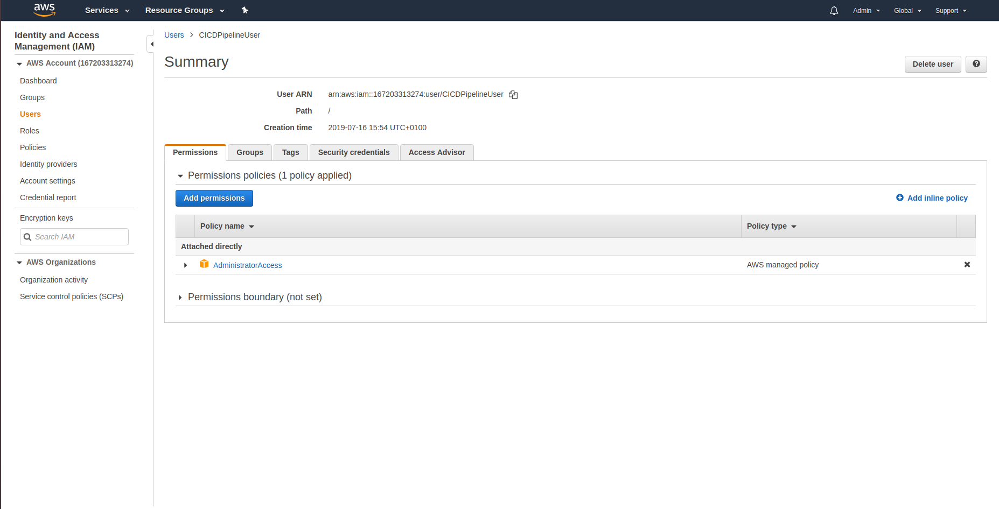
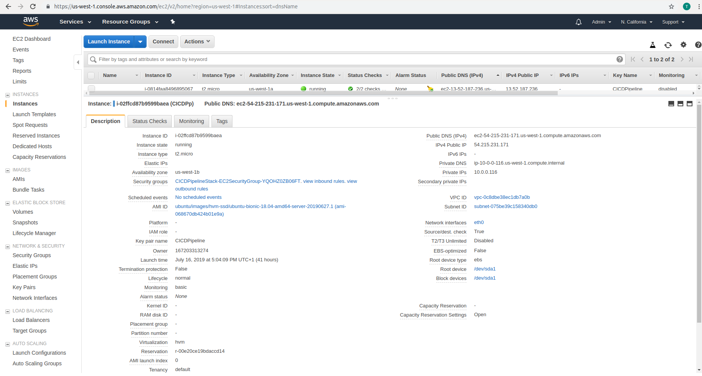
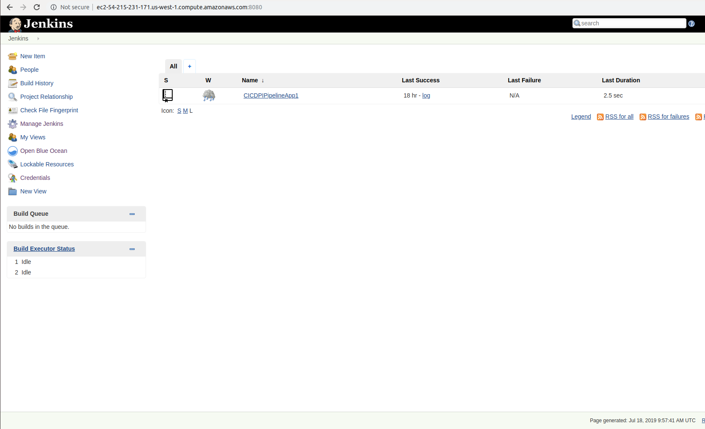
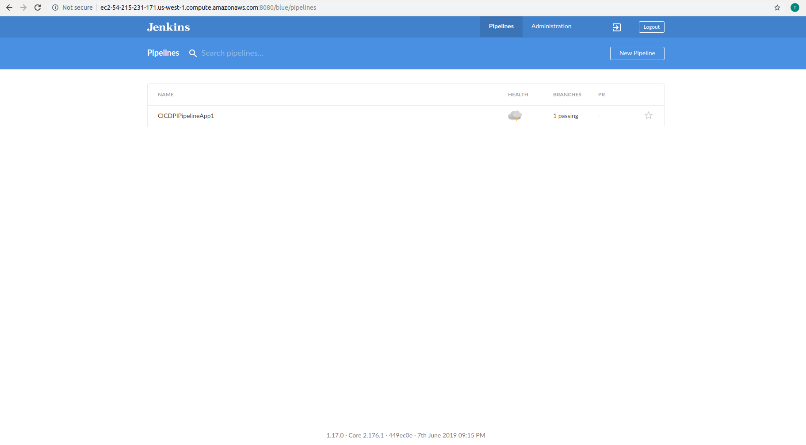
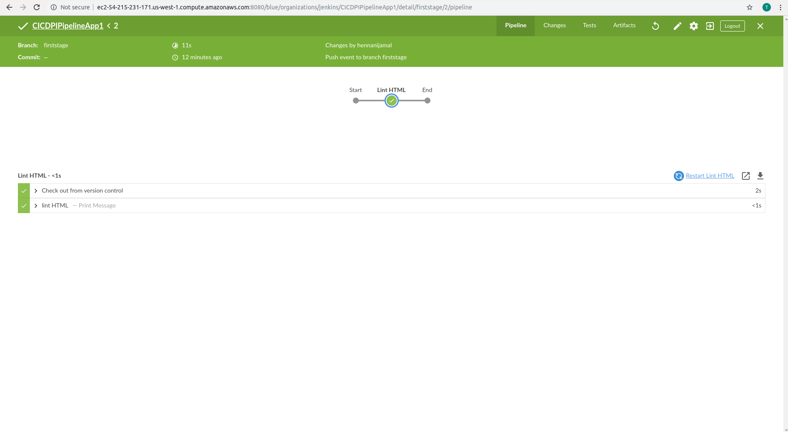
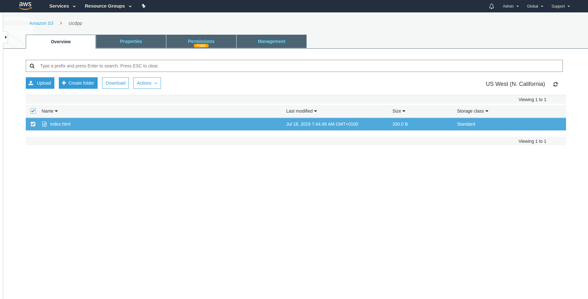
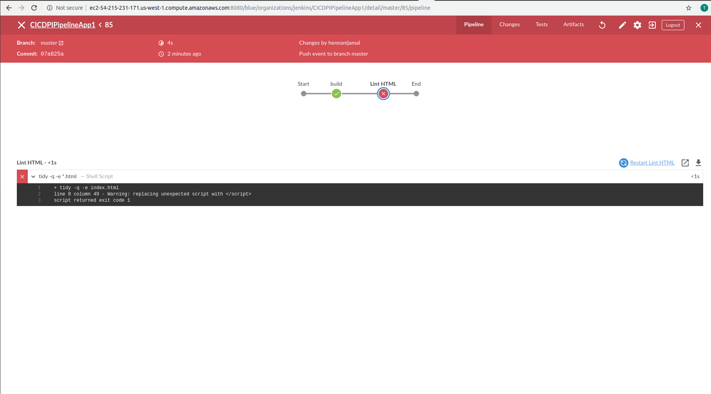
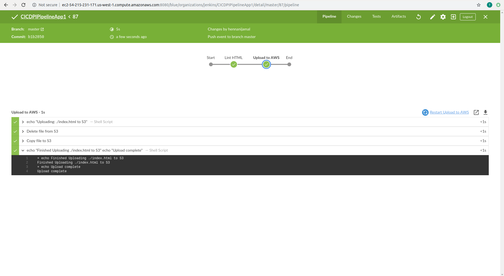
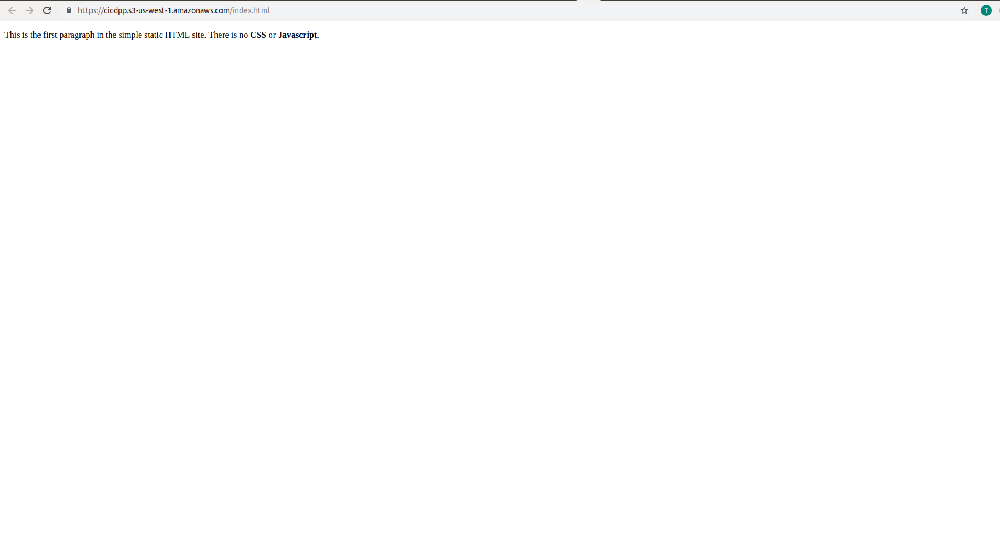

# CICDPipelineApp

## Rubric Items and their corresponding Screenshots

<table>

<tr>
<td>
    IAM Credential
</td>

<td>
    
</td>
</tr>

<tr>
<td>
    Create EC2 Instance
</td>

<td>
    
</td>
</tr>

<tr>
<td>
    Jenkins is installed and running
</td>

<td>
    
</td>
</tr>

<tr>
<td>
    ‘Blue Ocean’ is enabled
</td>

<td>
    
</td>
</tr>

<tr>
<td>
    Barebones Pipeline is added
</td>

<td>
    
</td>
</tr>

<tr>
<td>
    Publishes the static site to S3
</td>

<td>
    
</td>
</tr>

<tr>
<td>
    HTML linter catches issues with HTML
</td>

<td>
    <h3> Fail lint HTML </h3>
       
    <h3> Pass lint HTML </h3>
    

</td>
</tr>

<tr>
<td>
    Functional Github repository

The link to the github repo is in `githubrepo.txt` file

Here is the link to the `index.html` on s3: 
[https://cicdpp.s3-us-west-1.amazonaws.com/index.html](https://cicdpp.s3-us-west-1.amazonaws.com/index.html)
</td>

<td>
    
</td>
</tr>

</table>